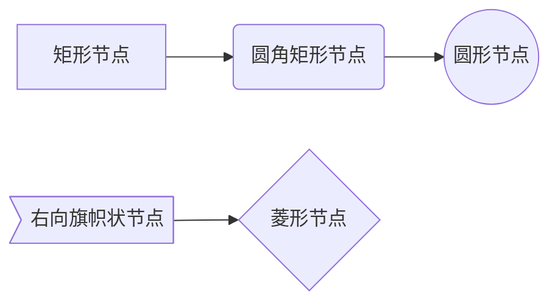
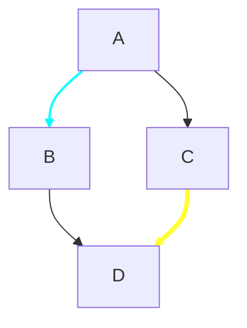
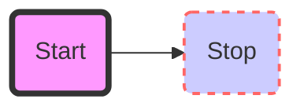
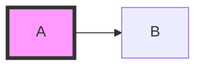
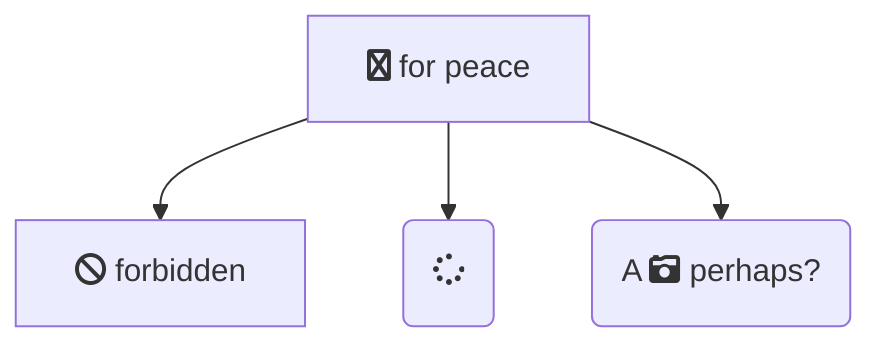
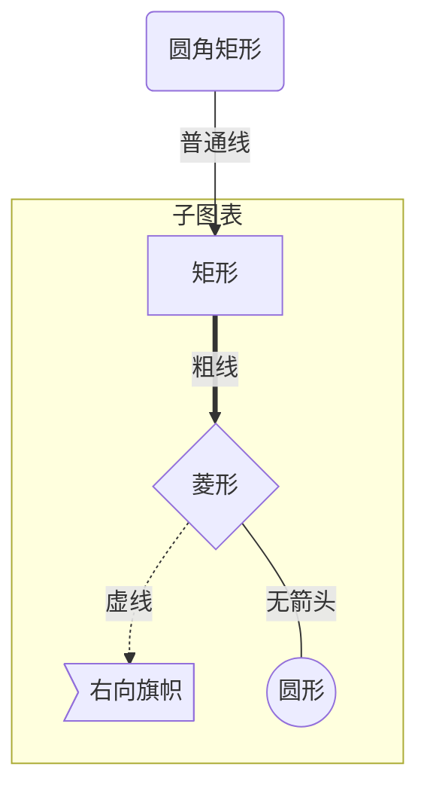
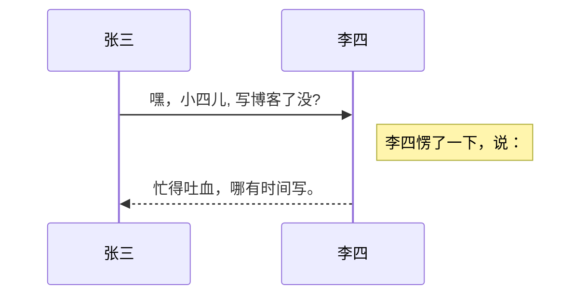
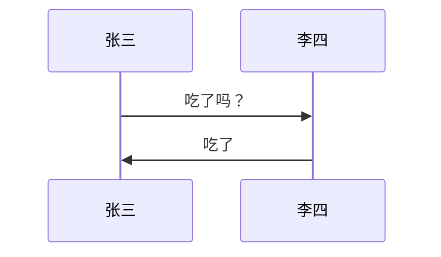
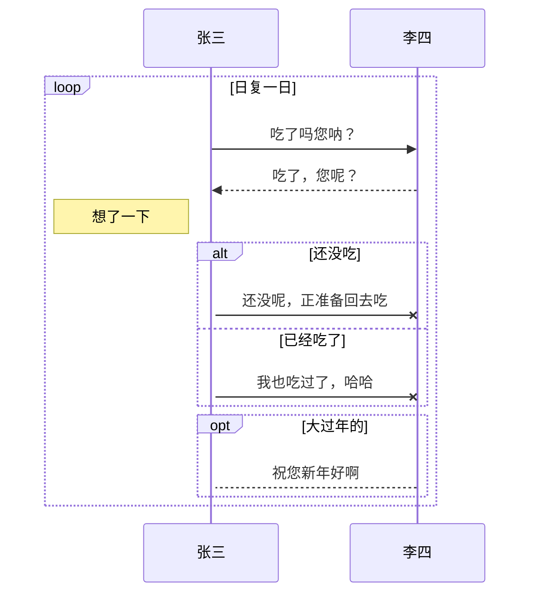

概述:003-tools-markdown-流程图

<!--more-->
# 软件设置
Markdown Preview Enhanced
默认支持，直接使用，预览功能 最流程图支持不够。

推荐使用插件：Markdown Preview Enhanced

Markdown Preview Enhanced 内部支持 mermaid, PlantUML, WaveDrom,GraphViz，Vega & Vega-lite，Ditaa 图像渲染。
你也可以通过使用 Code Chunk 来渲染 TikZ, Python Matplotlib, Plotly 等图像。

## 流图-mermaid
Mermaid 是一个用于画流程图、状态图、时序图、甘特图的库，使用 JS 进行本地渲染，广泛集成于许多 Markdown 编辑器中。

Mermaid 作为一个使用 JS 渲染的库，生成的不是一个“图片”，而是一段 HTML 代码，因此安全许多。

官网：https://mermaidjs.github.io/
Github 项目地址：https://github.com/knsv/mermaid

### 流程图-graph
语法，左侧 // 不需要
```text
  //        ```mermaid
  //        graph 方向
  //          A --> B
  //        ```
```
说明 
1. 三个“`”后的mermaid表示使用这个语言化图
2. graph：流程图
3. graph 后字符：方向描述
4. 实际业务

#### 方向描述
```
    用词	含义
    TB	从上到下
    BT	从下到上
    RL	从右到左
    LR	从左到右
```

#### 节点定义
即流程图中每个文本块，包括开始、结束、处理、判断等。Mermaid 中每个节点都有一个 id，以及节点的文字。
```
表述	说明
id[文字]	矩形节点
id(文字)	圆角矩形节点
id((文字))	圆形节点
id>文字]	右向旗帜状节点
id{文字}	菱形节点
```

需要注意的是，如果节点的文字中包含标点符号，需要时用双引号包裹起来。
另外如果希望在文字中使用换行，请使用 替换换行

#### 节点间的连线
```
表述	说明
>	添加尾部箭头
-	不添加尾部箭头
--	单线
--text--	单线上加文字
==	粗线
==text==	粗线加文字
-.-	虚线
-.text.-	虚线加文字
```

线条 箭头 可以组合使用
#### 子图表
使用以下语法添加子图表
```
subgraph 子图表名称
    子图表中的描述语句...
end
```
#### 样式
- linkStyle 后面的数字表示第几根线，从 0 开始。可以指定颜色和粗细。

- 可以设置节点背景，边框颜色，粗细，实线还是虚线

- 样式类

定义一个名为 default 的类，节点没有指定特定样式类时，将都会应用这个样式类。


#### 图标-对 fontawesome 的支持 
使用 fa: #图表名称# 的语法添加 [fontawesome](https://fontawesome.com/)。


#### 示例




### 序列图、时序图-sequenceDiagram
语法
```
  //```mermaid
  //sequenceDiagram
  //  [参与者1][消息线][参与者2]:消息体
  //```
  或
  //```mermaid
  //sequenceDiagram
  //  participant 参与者 1
  //  participant 参与者 2
  //  ...
  //  participant 简称 as 参与者 3 #该语法可以在接下来的描述中使用简称来代替参与者 3
  //```

```



#### 消息线
```
|类型|描述|
|->|无箭头的实线|
|-->|无箭头的虚线|
|->>|有箭头的实线|
|-->>|有箭头的虚线|
|-x|末端为叉的实线（表示异步）|
|--x|末端为叉的虚线（表示异步）|
```

#### 处理中
```
在消息线末尾增加 + ，则消息接收者进入当前消息的“处理中”状态；
在消息线末尾增加 - ，则消息接收者离开当前消息的“处理中”状态。
```
或者使用以下语法直接说明某个参与者进入“处理中”状态:activate 参与者

#### 标注
语法如下
```
Note 位置表述 参与者: 标注文字
```
其中位置表述可以为
```
表述	含义
right of	右侧
left of	左侧
over	在当中，可以横跨多个参与者
```

#### 循环
语法如下
```
loop 循环的条件
    循环体描述语句
end
```

#### 判断
```
alt 条件 1 描述
    分支 1 描述语句
else 条件 2 描述 # else 分支可选
    分支 2 描述语句
else ...
    ...
end
```

如果遇到可选的情况，即没有 else 分支的情况，使用如下语法：
```
opt 条件描述
    分支描述语句
end
```

#### 示例

